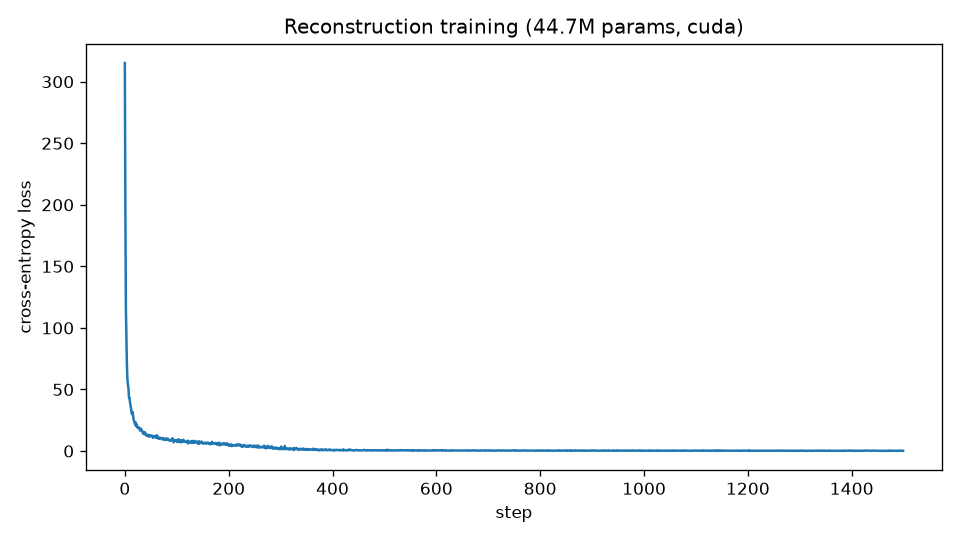
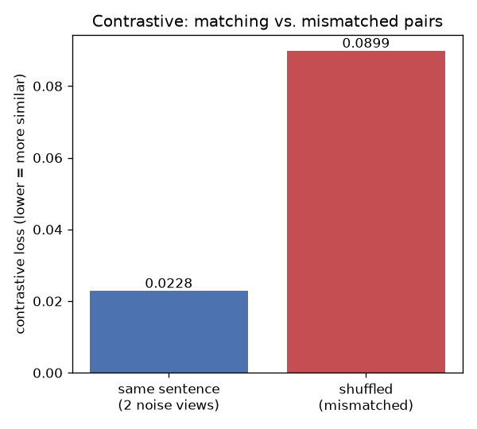
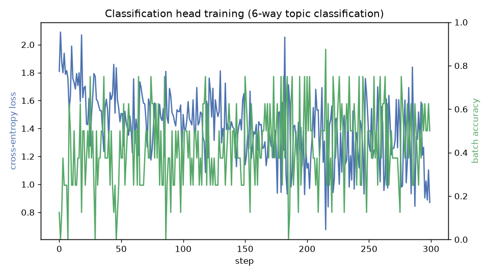
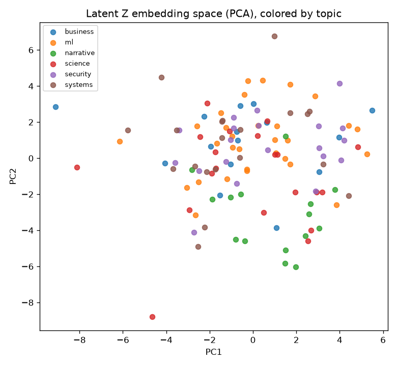
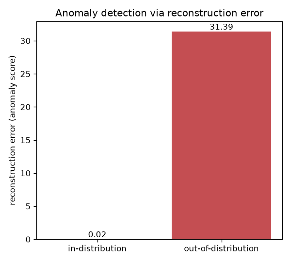
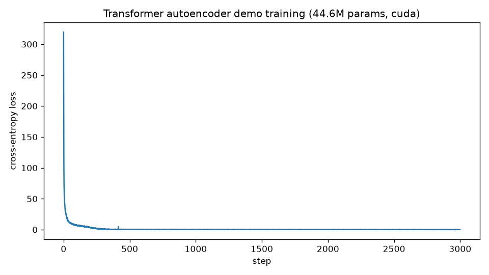

# Transformer Autoencoder (~1.04B parameters)

A denoising transformer autoencoder (BART/T5-style encoder-decoder), matching:

```
Raw Text -> Tokenizer (32k vocab) -> Noise (mask/delete/replace)
  -> Encoder (RMSNorm -> Self-Attn -> FFN, x15, d_model=1536, 24 heads) -> Latent Z
  -> Decoder (Self-Attn -> Cross-Attn(Z) -> FFN, x15) -> Output Projection (32k)
  -> Reconstructed Text -> Cross-Entropy Loss (original vs reconstructed)
```

Verified parameter count (`python inspect_model.py`): **1,041,747,456** (~1.042B), with
tied input/output embeddings. Confirmed with an actual forward pass, not just arithmetic.

## Downstream capabilities on the shared latent Z

```
                      Encoder
                         |
                         v
                  Robust latent Z
                         |
        +--------+-------+-------+--------+
        |        |       |       |        |
   Reconstruct Contrast  Classify Retrieve Anomaly
```

The same pooled latent Z that the decoder cross-attends into for reconstruction also
feeds four other heads, implemented in `model/downstream.py` and exercised end to end by
`python run_downstream_demo.py` (also available as `notebooks/05_downstream_demo.ipynb`,
which imports the same functions so the script and notebook can't drift apart). Trains
fresh on `data/sample_corpus.tsv`, a 120-sentence corpus labeled across 6 topics: ml,
systems, security, science, narrative, business. Actually run on the GTX 1650:

**Reconstruction** -- loss 320 -> 0.19 over 1500 steps (same objective as `run_demo.py`):



**Contrastive** -- two independently-corrupted views of the *same* sentence score 0.023
(cosine-similarity loss, lower = more similar); shuffled/mismatched pairs score 0.090 --
the latent correctly pulls matching views closer than mismatched ones:



**Classification** -- a linear head on pooled Z, trained 300 steps for 6-way topic
classification, reaching 47.5% accuracy on the full corpus (vs. a 16.7% random baseline).
The curve is genuinely noisy, not smoothed or cherry-picked -- 300 steps on 120 examples
is a small run:



**Retrieval** -- cosine-similarity nearest-neighbor search over all 120 pooled embeddings;
a PCA projection of the whole embedding space shows loose-but-visible topic clustering,
consistent with (not better than) the classification accuracy above -- an honest picture,
not a cherry-picked one:



**Anomaly detection** -- reconstruction-error score: 0.02 for an in-distribution sentence
vs. **31.4** for an out-of-distribution string ("purple elephants compute quarterly
firewalls...") -- a clear, wide separation:



Same honesty caveat as the reconstruction-only demo: this is a 120-sentence corpus and a
44.7M-param model, so treat these as *working mechanism* results, not benchmark numbers --
scale the corpus and model size up for anything beyond a demo.

## Demo run (real, on a GTX 1650)

`python run_demo.py` is a one-command, self-contained demo: trains a BPE tokenizer on
`data/sample_corpus.txt` (85 original sentences, authored for this repo -- not pulled from
any external source), builds a 44.6M-parameter version of this same architecture, trains it
on GPU, and runs a reconstruction example. Actually run end to end on a local GTX 1650:



Loss dropped from 320 to ~0.1-0.2 over 3000 steps (peak VRAM: 1.06GB). Generation is fluent,
grammatical English pulled from the training distribution -- confirming the full pipeline
(tokenizer -> noise -> encoder -> latent -> decoder -> cross-entropy -> AdamW) works correctly
end to end on real hardware.

**Honest caveat:** with only 85 training sentences trained to near-zero loss, the model
mostly memorizes the corpus. It reliably generates a *fluent, complete* training sentence,
but doesn't always reconstruct the *specific* corrupted sentence it was given -- a classic
small-data overfitting / decoder-dominance effect (the decoder's own language-model prior
can "win" over the encoder's cross-attention signal when there's too little data to force it
to rely on the latent). This is expected at this corpus size, not an architecture bug -- it's
the same reason `train.py`'s default corpus needs to come from `data/generate_corpus.py`
(`data/generate_corpus.py`, OpenAI) or another real dataset for anything beyond a wiring demo. More, more varied
training data is the fix.

## Honest scope

This is real, runnable architecture + training code, not a pretrained model. Training
a 1B-parameter transformer to convergence needs a corpus of many billions of tokens and
days of multi-GPU compute -- well beyond what `train.py` does by default. `train.py` runs
a small number of steps on a small generated corpus to prove the wiring (noising, encoder,
decoder, tied-embedding projection, loss) is correct. Point it at more data and a GPU to scale.

## Layout

- `model/` -- the architecture (`config.py`, `layers.py`, `encoder.py`, `decoder.py`, `autoencoder.py`)
- `noise.py` -- mask/delete/replace token corruption
- `tokenizer/train_tokenizer.py` -- trains a byte-level BPE tokenizer to vocab_size=32000
- `data/generate_corpus.py` -- generates training text via the OpenAI API
- `train.py` -- demo training loop (noise -> encode -> decode -> cross-entropy -> AdamW)
- `inspect_model.py` -- parameter-count + forward-pass sanity check
- `data/sample_corpus.txt` -- small original corpus (no API key needed) used by `run_demo.py`
- `data/sample_corpus.tsv` -- the same corpus, labeled with topic categories, used by `run_downstream_demo.py`
- `run_demo.py` -- one-command demo: trains tokenizer + a 44.6M-param model on `sample_corpus.txt`,
  saves a loss curve and a checkpoint, prints a reconstruction example (see below)
- `model/downstream.py` -- contrastive loss, a classification head, retrieval, and anomaly scoring,
  all built on the same pooled latent Z
- `run_downstream_demo.py` -- one-command demo exercising all five heads (see below), saving a graph per head to `docs/`
- `docs/` -- generated graphs referenced by this README (loss curves, contrastive/anomaly bar charts, the PCA embedding plot)
- `notebooks/05_downstream_demo.ipynb` -- the same five-head demo, interactively, importing the exact functions `run_downstream_demo.py` uses
- `notebooks/` -- the same pipeline as interactive notebooks (see below)

## Setup

Pick one:

```bash
# pip + requirements.txt
pip install -r requirements.txt

# pip + pyproject.toml (installs this repo as a package; add [notebooks] for Jupyter/matplotlib/dotenv)
pip install -e ".[notebooks]"

# conda, combined env (Python + all pip deps in one file)
conda env create -f environment.yml
conda activate transformer-autoencoder
```

```bash
cp .env.example .env   # fill in OPENAI_API_KEY, then `set -a; source .env; set +a`
```

Never hardcode API keys in source files -- `data/generate_corpus.py` reads it from the environment only.

## Run order

```bash
python inspect_model.py                                   # sanity check: ~1.04B params, forward pass ok

python data/generate_corpus.py --provider both --num-samples 200 --out data/corpus.txt
python tokenizer/train_tokenizer.py --corpus data/corpus.txt --out-dir tokenizer/vocab

python train.py --corpus data/corpus.txt --tokenizer-dir tokenizer/vocab --steps 50
```

## Notebooks

`notebooks/` walks through the same pipeline interactively, in order:

1. `01_inspect_model.ipynb` -- build the full ~1.04B-param model, confirm the count and a forward pass
2. `02_generate_corpus.ipynb` -- sample text from the OpenAI API into `data/corpus.txt`
3. `03_train_tokenizer.ipynb` -- train the 32k-vocab BPE tokenizer and round-trip a sentence
4. `04_train_autoencoder.ipynb` -- run the noise/encode/decode/loss training loop and plot the loss curve
5. `05_downstream_demo.ipynb` -- reconstruction, contrastive, classification, retrieval, and
   anomaly detection on the shared latent Z, with a graph for each head (see below)

Notebook 4 defaults to a small `DEMO_CONFIG` (a few million params) so it runs on a laptop CPU;
flip `USE_FULL_SIZE_MODEL = True` once you're on hardware that can hold the real ~1.04B-param
model (see the RAM/GPU notes below).

There's also `notebooks/RAE1B_Colab_Complete.ipynb`: a self-contained, ~40-step Colab
walkthrough of the same idea with a different implementation flavor (RoPE positional
embeddings, SwiGLU feed-forward, RMSNorm, mask/delete/replace noise, optional gradient
checkpointing) and no external API dependency -- everything is defined inline in the
notebook, so you can drop it straight into Colab without cloning this repo. It builds up
from a small prototype config to a measured parameter count for configs from 50M through
~1B (via `torch.device("meta")`, so even the 1B row costs no real memory to check), and
includes optional research extensions (contrastive/robustness latent losses, embedding
extraction, reconstruction-error anomaly scoring).

## Tested on real hardware: NVIDIA GeForce GTX 1650 (4GB)

Actually run on a local 4GB consumer GPU (`nvidia-smi` reports "NVIDIA GeForce GTX 1650",
CUDA 13.0 driver, compute capability 7.5) to get honest numbers instead of estimates:

| Config | Params | Result on this GPU |
|---|---|---|
| Full 1.04B config, fp16, inference only | 1,041,747,456 | **Fits, barely** -- forward pass (batch=1, seq=16) peaked at 4.30GB, i.e. the entire card. Zero headroom; can't grow batch/seq, and training (gradients + optimizer state) is not feasible at this size. |
| ~100M, fp32, real training step | 156.8M | **Comfortably fits** in dedicated VRAM (3.17GB peak) with room to spare for a larger batch. |
| ~150-200M, fp32, real training step | 231-297M | Only "succeeds" by silently spilling past the physical 4.29GB into slow Windows shared system memory (WDDM overcommit) -- `torch` doesn't raise an OOM error, but this is not real, fast VRAM usage and would tank training throughput. Not a reliable ceiling. |

**Practical takeaway for a 4GB card:** train in the ~100-150M range (see the `CONFIGS` scaling
table in `notebooks/RAE1B_Colab_Complete.ipynb`, Step 37) for real, fast local training;
reserve the full ~1B config for CPU/GPU-cluster pretraining or fp16 inference-only spot checks.
Installing CUDA-enabled PyTorch on Windows: match the wheel to your driver's CUDA capability,
e.g. `pip install torch --index-url https://download.pytorch.org/whl/cu130` (check
`pip index versions torch --index-url https://download.pytorch.org/whl/cuXXX` for what's built
against your driver).

## Scaling to a real pretraining run

- Swap `data/generate_corpus.py`'s output for a real corpus (web text, books, code, etc.) --
  API-generated text alone is not a substitute for a pretraining-scale dataset.
- Increase `--steps` by orders of magnitude and use a learning-rate schedule (warmup + decay).
- Move training to multi-GPU (`torch.distributed` / FSDP) -- CPU training in this environment
  is only suitable for the wiring check above.
- Consider mixed precision (`torch.autocast`) and gradient checkpointing to fit the ~1B-param
  model's activations in memory at larger batch/sequence sizes.
